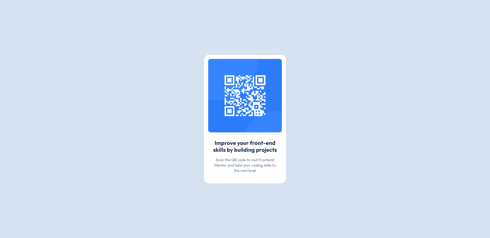

# Frontend Mentor - QR code component solution

This is a solution to the [QR code component challenge on Frontend Mentor](https://www.frontendmentor.io/challenges/qr-code-component-iux_sIO_H). Frontend Mentor challenges help you improve your coding skills by building realistic projects.

## Table of contents

- [Overview](#overview)
  - [Screenshot](#screenshot)
  - [Links](#links)
- [My process](#my-process)
  - [Built with](#built-with)
  - [Useful resources](#useful-resources)
- [Author](#author)

## Overview

### Screenshot

### Links

- Solution URL: [GitHub Repository](https://github.com/firatyedibela/qr-code-component)
- Live Site URL: [Live Project](https://firatyedibela.github.io/qr-code-component/)

## My process

### Built with

- [Vite](https://vitejs.dev): A fast build tool and development server.
- [React](https://reactjs.org): A JavaScript library for building user interfaces.
- [HTML](https://developer.mozilla.org/en-US/docs/Web/HTML): The standard markup language.
- [CSS](https://developer.mozilla.org/en-US/docs/Web/CSS): For styling and layout.
- [SCSS](https://sass-lang.com): A CSS preprocessor that extends CSS.

### Useful resources

- [Deploying Vite App to GitHub Pages](https://medium.com/@aishwaryaparab1/deploying-vite-deploying-vite-app-to-github-pages-166fff40ffd3): This article provided clear instructions that helped me deploy my Vite project to GitHub Pages.

## Author

- Frontend Mentor - [@firatyedibela](https://www.frontendmentor.io/profile/firatyedibela)
